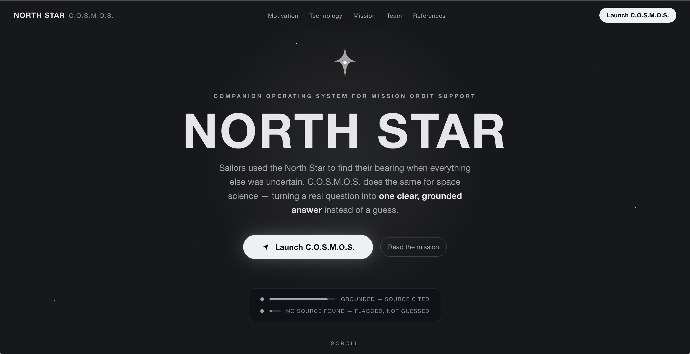
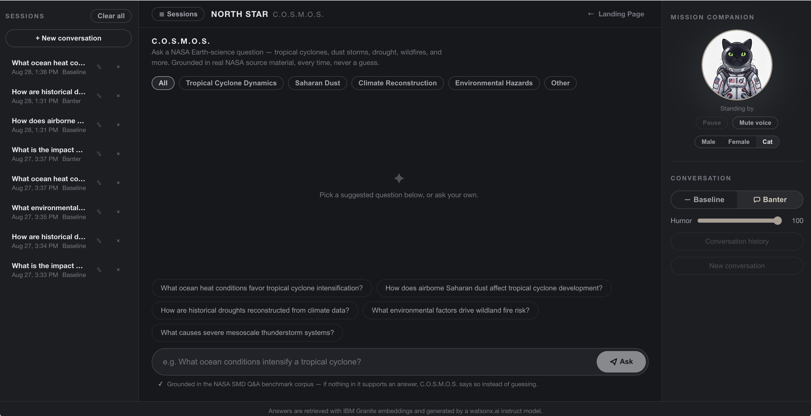
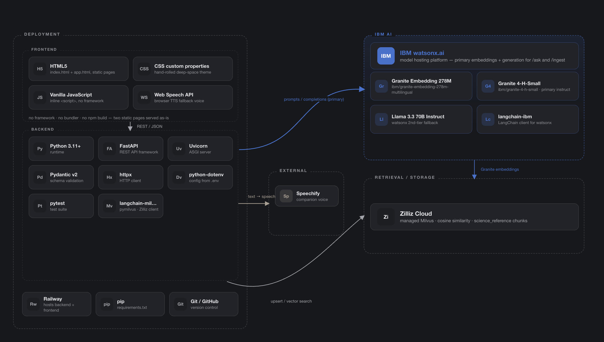

# The North Star — IBM Bob August Challenge

The North Star provides guidance and direction to find the true north when navigators are lost in the wilderness. It is the one star in the sky that does not move and pointing to north. C.O.S.M.O.S. (Companion Operating System for Mission Orbit Support) system is built based on this principle to provide one clear and grouned answer. 

Challenge theme: Reimagine Space Exploration with AI. 

Link: https://thenorthstars.up.railway.app/

## Motivation

The North Star is a web application for C.O.S.M.O.S. as a grounded NASA Earth-science Q&A console. Ask questions about space events and C.O.S.M.O.S. answers from a real NASA source passage with citation. 

## How to Use

1. Click **Launch C.O.S.M.O.S.** to open the console.
2. Select any domain to explore. Space explorations events: Tropical Cyclone Dynamics, Saharan Dust, Climate Reconstruction, Environmental Hazards, or Other.
3. Select one of the 3 companions: male, female and cat
4. Choose a persona either Baseline or Banter. Banter generates response with humor, while Baseline provide factual response
5. Select one of the suggested questions from domain.
6. The response will be shared both in text and speech format with a grounded response with a confidence score and a source citation. If there is an unmatched question, it will return "no grounded answer"

## Demo

Demo video Youtube/Canva:

https://www.youtube.com/watch?v=BE3CKr1vojY
https://canva.link/thenorthstarcosmos

## AI Approach and Architecture

### Retrieval-augmented generation — IBM Granite embeddings + Zilliz (or Gemini)

NASA SMD Q&A benchmark passages are embedded with IBM's Granite embedding model on watsonx.ai. Then, it is indexed in Zilliz Cloud (managed Milvus) as `science_reference` documents. Every answer C.O.S.M.O.S. gives is generated from a passage retrieved from that index. This allows every response being traceable back to a real source.

### Grounded generation — IBM watsonx.ai

1. Retrieve the single best-matching passage for the question.
2. Convert its cosine similarity to a `[0, 1]` confidence score. If it is below a 0.68 threshold, an honest no-match response is returned.
3. If above the 0.68 threshold, Granite/Mistral instruct model on watsonx.ai generates the grounded answer.
5. Every grounded answer carries a source reference line back to the document

### Companion system

1. Ingest to chunk, embed, and upsert documents into Zilliz.

2. Query to retrieve the actual source passages a question matches
3. Ask based on Q&A endpoint.
4. Record the transcript for conversation and present in console's Conversation History
5. Convert text to speech and generate voices for companion answer via Speechify

### Mission-based domains

The mission based domains are categorize based on datasets such as Tropical Cyclone Dynamics, Saharan Dust, Climate Reconstruction, Environmental Hazards, or Other. That scopes retrieval to documents tagged with the domain value. If a question is not in the database, the program will return as a no match found  against the whole corpus.

### Conversational memory

A conversation is remembdered across calls that share a session id. Each session has its unique session id. Message exchanges are  persisted to Zilliz where the context survives a restart. Conversionational memory shapes based on a follow-up question, and every answer is still generated fresh from a retrieved passage. 

## How IBM Bob was used
**IBM Bob** (Plan Mode) served as the project's core development engine for development workflow from initial blueprint to final code review. We leverage the Plan mode as a structured approach for architecting the FastAPI backend and console frontend. The product utilizes the watsonx.ai/Granite stack. The architecture diagram is designed using Figma MCP server.