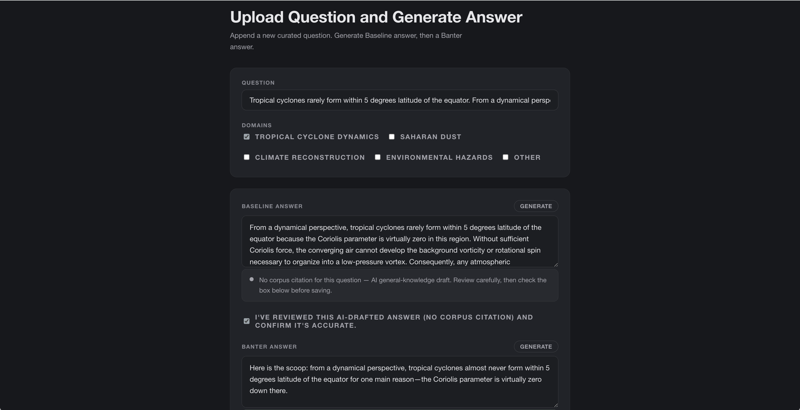

# The North Star — IBM Bob August Challenge

The North Star provides guidance and direction to find the true north when navigators are lost in the wilderness. It is the one star in the sky that does not move and pointing to north. Companion Operating System for Mission Orbit Support (C.O.S.M.O.S.) platform is built based on this principle to provide a grounded answer. 

Challenge theme: Reimagine Space Exploration with AI. 

Link: https://thenorthstars.up.railway.app/

##  Turn a real question into one clear, grounded answer instead of a guess

The North Star is a web application for C.O.S.M.O.S. as a grounded NASA Earth-science Q&A console. Ask questions about space events and answers from a real NASA source passage with citation. 

## How to Use

1. Click **Launch C.O.S.M.O.S.** to open the console.
2. Select any domain to explore. Space explorations events: Tropical Cyclone Dynamics, Saharan Dust, Climate Reconstruction, Environmental Hazards, or Other.
3. Select one of the 3 companions: male, female and cat
4. Choose a persona either Baseline or Banter. Banter generates response with humor, while Baseline provide factual response
5. Select one of the suggested questions from domain.
6. The response will be shared both in text and speech format with a grounded response with a confidence score and a source citation. If there is an unmatched question, it will return "no grounded answer" found

## AI Approach and Architecture
The architecture diagram is designed using Figma MCP server.

| Layer | Technology |
| --- | --- |
| Frontend | Vanilla HTML, CSS, JavaScript (landing page + console) |
| Backend API | FastAPI (Python), Uvicorn |
| Embeddings | IBM Granite embedding model on watsonx.ai (`granite-embedding-278m-multilingual`) |
| Vector store | Zilliz Cloud (managed Milvus) |
| Grounded generation | IBM watsonx.ai — Granite instruct model |
| Conversational memory | Session history persisted in Zilliz |
| Text-to-speech | Speechify API |
| Hosting | Railway |

### Retrieval-augmented generation — IBM Granite embeddings + Zilliz (or Gemini)

NASA SMD Q&A benchmark passages are embedded with IBM's Granite embedding model on watsonx.ai. Then, it is indexed in Zilliz Cloud (managed Milvus) as `science_reference` documents. Every answer C.O.S.M.O.S. gives is generated from a passage retrieved from that index. This allows every response being traceable back to a real source.

### Grounded generation — IBM watsonx.ai

1. Retrieve the single best-matching passage for the question.
2. Convert its cosine similarity to a `[0, 1]` confidence score. If it is below a 0.68 threshold, an honest no-match response is returned.
3. If above the 0.68 threshold, Granite/Mistral instruct model on watsonx.ai generates the grounded answer.
5. Every grounded answer carries a source reference line back to the document

### Companion system

1. Ingest to chunk, embed, and upsert documents into Zilliz.
2. Query to retrieve the actual source passages a question matches
3. Ask based on Q&A endpoint.
4. Record the transcript for conversation and present in console's Conversation History
5. Convert text to speech and generate voices for companion answer via Speechify

### Mission-based domains

The mission based domains are categorize based on datasets such as Tropical Cyclone Dynamics, Saharan Dust, Climate Reconstruction, Environmental Hazards, or Other. That scopes retrieval to documents tagged with the domain value. If a question is not in the database, the program will return as a no match found  against the whole corpus.

### Conversational memory

A conversation is remembdered across calls that share a session id. Each session has its unique session id. Message exchanges are  persisted to Zilliz where the context survives a restart. Conversionational memory shapes based on a follow-up question, and every answer is still generated fresh from a retrieved passage. 

### Upload Question and Generate Answer

An upload tool to extend the curated preset Q&A set. 

The workflow: 
1. Enter a question
2. Select one or more domains
3. Generate a Baseline answer and a Banter answer
4. **Save entry**.

**Baseline answers**
The answers are generated based on either corpus-grounded and drafted from a retrieved passage, or a general-knowledge fallback when no confident corpus match exists. User can review and check an acknowledgment box before saving. 

**Banter answer**
It is a restyle of the reviewed Baseline answer and never introduces new facts.

## Demo

Demo video Youtube/Canva:

- Youtube: https://www.youtube.com/watch?v=BE3CKr1vojY
- Canva: https://canva.link/thenorthstarcosmos

The Companion Operating System for Mission Orbit Support platform (C.O.S.M.O.S.).  

## Screens

| Screen | Function |
| --- | --- |
| Landing page | Motivation, Technology & Modules, Mission, Team, and **Launch C.O.S.M.O.S.** entry point into the console |
| Console | Main Q&A interface to pick a domain and companion/persona, ask a question, and read a grounded answer with confidence score, source citation, and voice playback |
| Sessions panel | Browse and resume past conversations |
| Conversation history | View the transcript of the current session |
| Upload Question and Generate Answer | Internal tool to append a new curated Q&A entry: draft a Baseline answer (corpus-grounded via retrieval, or a flagged general-knowledge fallback). Then, restyle it into a Banter answer.  Save both directly into the preset database. |

## How IBM Bob was used
**IBM Bob** (Plan Mode) served as the project's core development engine for development workflow from initial blueprint to final code review. We leverage the Plan mode as a structured approach for architecting the FastAPI backend and console frontend. The platform utilizes the **watsonx.ai/Granite stack**. 
