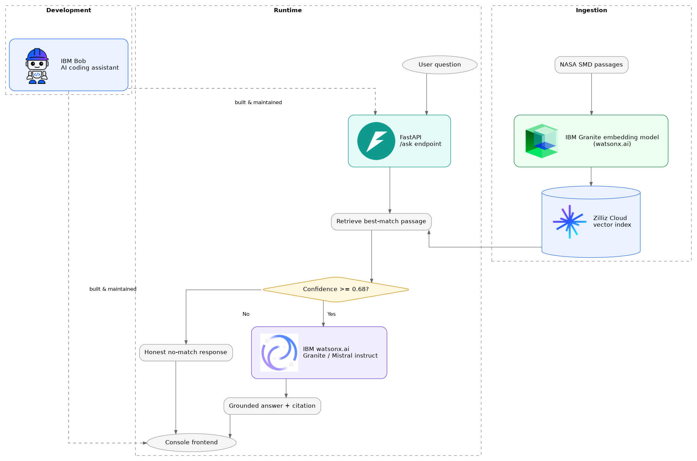

# The North Star — IBM Bob August Challenge

_Sailors used the North Star to find their bearing when everything else was uncertain. This project does the same job for a real question about space science, turning it into one clear, grounded answer instead of a guess._

Challenge theme: Reimagine Space Exploration with AI

## Motivation

The North Star is the landing page for **ChortleChat**, a grounded NASA Earth-science Q&A console. Ask a real question in plain English — tropical cyclones, dust storms, drought, wildfires, and more — and ChortleChat answers from a real NASA source passage, cites where that answer came from, and says so honestly when nothing in its corpus supports an answer, rather than guessing. Two voices are available: **Baseline**, direct and no-commentary, and **Banter**, the same fact told with personality. Persona only changes how a true thing is said, never whether it's said or what it claims. Built for the IBM Bob AI Builders Challenge (August theme: *Reimagine Space Exploration with AI*).

## How to Use

1. Open the North Star landing page for the pitch, the Technology & Modules breakdown, the Mission, and the Team.
2. Click **Launch ChortleChat** to open the console.
3. Pick a domain to explore — Tropical Cyclone Dynamics, Saharan Dust, Climate Reconstruction, Environmental Hazards, or Other — or leave it on **All**. This scopes the suggested chips (and, server-side, retrieval itself) to that slice of the corpus.
4. Pick a persona — Baseline or Banter. Banter unlocks a humor slider; Baseline ignores it.
5. Ask a question, or pick one of the suggested chips.
6. Read the answer: a grounded response carries a confidence score and a source citation back to the passage it came from; an unmatched question gets an honest "no grounded answer" instead of a fabricated one.
7. Open **Past conversations** to browse and resume earlier conversations from this device, or **Conversation history** for the current one.

## Demo

Demo video: [add the demo video link]

## AI Approach and Architecture



### Retrieval-augmented generation — IBM Granite embeddings + Zilliz

NASA SMD Q&A benchmark passages are chunked and embedded with IBM's Granite embedding model on watsonx.ai, then indexed in Zilliz Cloud (managed Milvus) as `science_reference` documents. Every answer ChortleChat gives is generated from a passage retrieved from that index, never from the model's own memory, which is what keeps every response traceable back to a real source instead of a guess.

### Grounded generation — IBM watsonx.ai

1. Retrieve the single best-matching passage for the question.
2. Convert its cosine similarity to a `[0, 1]` confidence score. Below a 0.68 threshold, both personas return an honest no-match response instead of guessing.
3. Above threshold, an instruct model generates the grounded answer exactly once, always in Baseline's voice, strictly from the retrieved passage. When a Gemini API key is configured, Gemini is the primary generation model, since watsonx's own trial-tier rate limit was being hit too often to trust as the first attempt; watsonx's Granite/Mistral models become an automatic two-tier failover instead, on the same retrieved passage and the same no-hallucination rules regardless of which model actually answers — see `app/services/watsonx.py`.
4. If Banter is selected, it re-tells that already-generated, already-grounded answer in its own tone — it never answers the question itself and is explicitly instructed to introduce no new fact, number, or claim. This is what keeps "honesty is not a dial" a property of the code, not just a prompting convention.
5. Every grounded answer carries a source reference line back to the document and chunk it came from.

### API surface

`GET /health` — reports whether the required watsonx/Zilliz credentials are actually configured, not just that the process is running. `POST /ingest` — chunk, embed, and upsert documents into Zilliz. `POST /query` — retrieval only, for inspecting the actual source passages a question matches. `POST /ask` — the main Q&A endpoint described above. `GET /conversation/history` — the transcript for one conversation, for the console's Conversation History panel.

### Mission-based domains

`/ask` and `/query` both accept an optional `domain` — one of Tropical Cyclone Dynamics, Saharan Dust, Climate Reconstruction, Environmental Hazards, or Other — that scopes retrieval to documents tagged with that value (see `backend/scripts/tag_corpus_domains.py`). Omitting it searches the whole corpus, exactly as before this existed. If a chosen domain has nothing indexed at all, `/ask` retries once against the whole corpus rather than surfacing a false no-match. See `docs/API.md` for the full contract.

### Conversational memory

`/ask` remembers a conversation across calls that share a `session_id`: an in-process sliding window handles the common case of an active back-and-forth, and grounded exchanges are additionally persisted to Zilliz so that context survives a restart or a window that's trimmed older turns away. Memory only ever shapes what a follow-up question is *interpreted to mean* — every answer is still generated fresh from a retrieved passage, never from a remembered claim — and recall is always scoped to the caller's own session, never a cross-session search. See `docs/API.md` for the full contract.

## Quickstart

```bash
git clone https://github.com/HenryKhoo/IBMBobAugust.git
cd IBMBobAugust/backend
python3 -m venv .venv && source .venv/bin/activate
pip install -r requirements.txt
cp ../.env.example .env   # fill in WATSONX_* and ZILLIZ_* credentials
uvicorn app.main:app --reload --port 8000
```

Then serve `frontend/` with any static file server (e.g. `python3 -m http.server 5500`) and open `app.html`. See [SETUP.md](SETUP.md) for full setup, environment variable details, and the git workflow.

## How IBM Bob was used
**IBM Bob** (Plan Mode) served as our core development engine for development workflow from initial blueprint to final code review. We leverage the Plan mode for structured task execution, our team used IBM Bob to architect the FastAPI backend and console frontend. The product utilizes the watsonx.ai/Granite stack. 